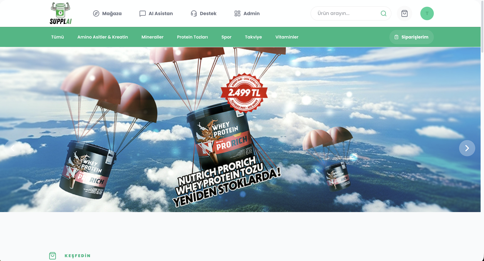
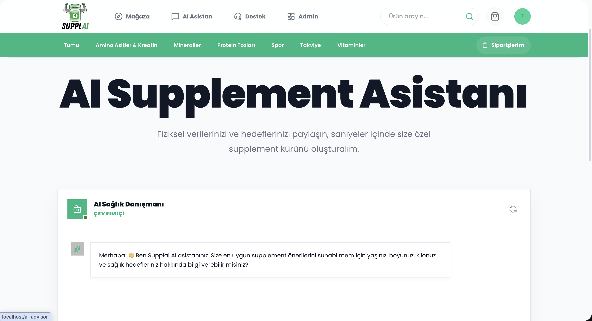
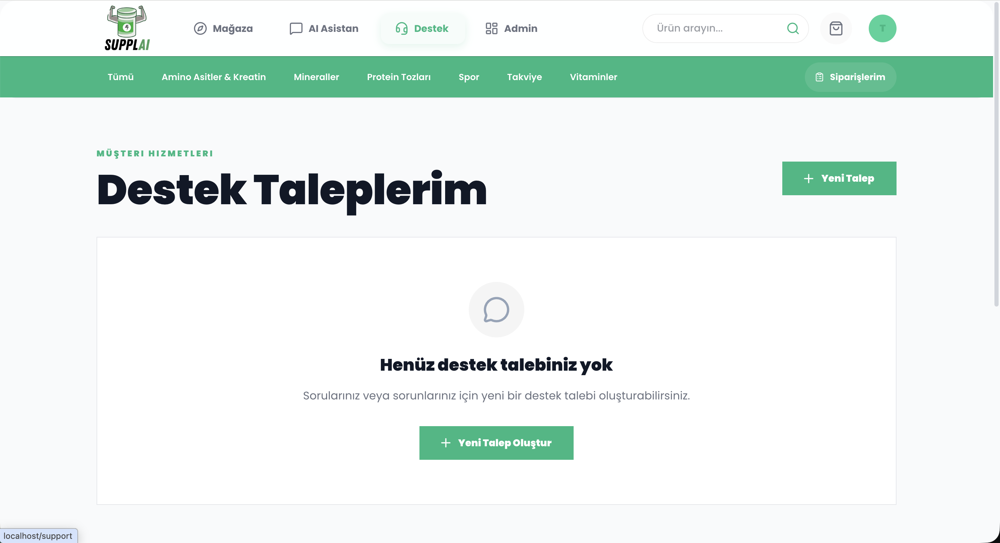
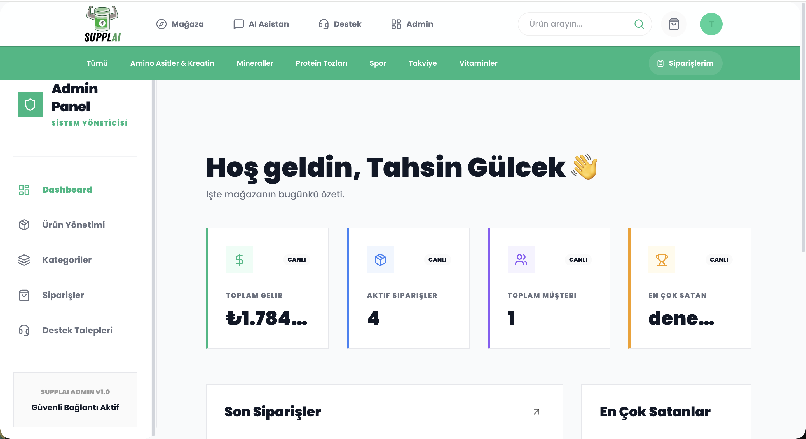
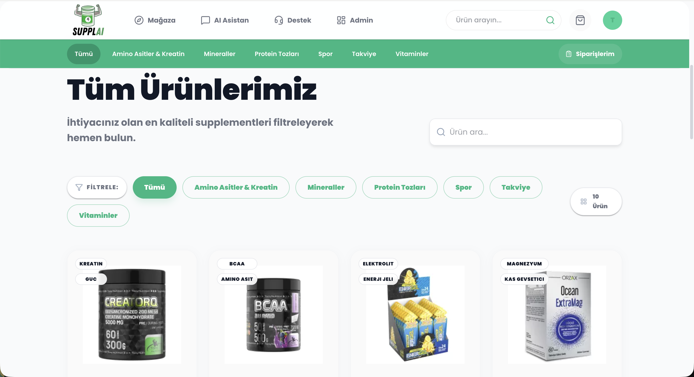

# Supplai - AI-Powered Supplement E-Commerce Platform

Supplai is a premium, full-stack e-commerce platform dedicated to health and nutrition. Built with modern technologies like **React**, **NestJS**, and **PostgreSQL**, it offers an intelligent shopping experience featuring an AI Health Advisor, advanced product filtering, and a robust administrative system.



## 🚀 Vision
Supplai bridge the gap between complex nutritional science and daily health routines through AI integration. From personalized advice to seamless delivery, Supplai is designed for users who prioritize their well-being.

---

## ✨ Key Features

### 🛒 High-Performance Storefront
*   **Dynamic Product Discovery**: Browse products by category and benefits (e.g., Focus, Energy, Recovery).
*   **Seamless Cart System**: Persistent shopping cart with real-time updates.
*   **Premium UI**: A sleek, dark-mode inspired aesthetic with glassmorphism and smooth animations.

### 🤖 AI Health Advisor
*   **Intelligent Recommendations**: Chat with an AI assistant that understands your health goals and recommends suitable supplements.
*   **Context-Aware**: Integrates with product database to provide real-time stock and benefit information.



### 🎫 Integrated Support System
*   **User Tickets**: Users can create support requests directly from their profile.
*   **Real-time Communication**: Track the status of your queries and receive responses from admins.



### 🛡️ Admin Management
*   **Full Inventory Control**: Manage products, categories, and stock levels.
*   **Order Tracking**: Advanced order management system with status updates.
*   **User Support Management**: A centralized hub to resolve user tickets.



---

## 🏗️ Technical Architecture

### **Frontend** (React + TypeScript)
Located in `/frontend`, the client is a modern SPA designed for speed and responsiveness.

*   **State Management**: Redux Toolkit for predictable state across categories, products, cart, and authentication.
*   **UI Framework**: Material-UI (MUI) v6 customized with a premium theme.
*   **Navigation**: React Router for nested layouts and protected routes.
*   **Data Fetching**: Axios with interceptors for JWT-based auth and array parameter serialization.

### **Backend** (NestJS + Prisma)
Located in `/backend`, the server follows a modular architecture for high scalability.

*   **Database**: PostgreSQL managed via Prisma ORM.
*   **Authentication**: JWT-based secure auth with role-balanced access (USER vs ADMIN).
*   **API Design**: RESTful architecture with DTO-based validation (class-validator).
*   **Services**:
    *   `ProductsModule`: Handles complex filtering and soft-delete logic.
    *   `AiModule`: GPT-powered advisor integration.
    *   `SupportModule`: Ticket lifecycle management.

---

## 🛠️ Project Structure

```text
Supplai/
├── backend/                # NestJS Server
│   ├── src/
│   │   ├── auth/           # Security & JWT logic
│   │   ├── products/       # Core product inventory
│   │   ├── orders/         # Transaction management
│   │   ├── ai/             # Health advisor logic
│   │   └── support/        # Ticket system
│   └── prisma/             # Schema definitions
├── frontend/               # React Client
│   ├── src/
│   │   ├── components/     # Atomic UI elements
│   │   ├── pages/          # Full page views
│   │   ├── store/          # Redux slices/global state
│   │   └── services/       # API abstraction layer
└── docker-compose.yml      # Orchestration for DB & Services
```

---

## 🚦 Getting Started

### Prerequisites
*   Node.js (v18+)
*   Docker & Docker Compose
*   PostgreSQL

### Installation

1. **Clone the repository**
   ```bash
   git clone https://github.com/your-username/supplai.git
   cd Supplai
   ```

2. **Environment Setup**
   *   Copy `.env.example` to `.env` in both `backend` and `frontend`.
   *   Fill in your `DATABASE_URL` and `OPENAI_API_KEY`.

3. **Launch with Docker**
   ```bash
   docker-compose up -d
   ```

4. **Prepare Database**
   ```bash
   cd backend
   npx prisma db push
   npx prisma db seed
   ```

---

## 📸 Screen Gallery

### Products Grid
Professional layout focusing on readability and visual appeal.


---

## 👨‍💻 Development
Supplai is built with a focus on **Code Quality** and **Performance**.
*   **TypeScript** used throughout the entire stack for type-safety.
*   **Soft-Delete** strategy for data integrity.
*   **Modular Architecture** allowing for easy scaling of features.

© 2026 Supplai Health Platform. All rights reserved.
